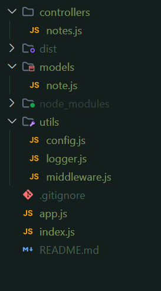

# Project Structure

# Learnings

## Backend

- [express-async-errors](https://github.com/MHammad33/Full-Stack-Learning/tree/express-async-errors) - Branch implementing `express-async-errors` for error handling in backend development.
